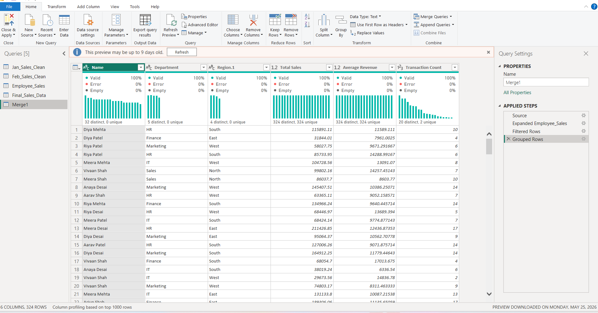

Data Leverage Power BI Project
Overview

This project demonstrates data cleaning and transformation using Power Query in Power BI.

Files Used
Jan.xlsx
Feb.xlsx
Employee.xlsx

Power Query

Data cleaning and transformation were performed using Power Query. The dataset was cleaned by changing data types, trimming text values, filtering invalid records, and creating additional date-related columns.

Append Queries

Sales data from January and February were appended into a single table named Final_Sales_Data to create a unified dataset for analysis.

Merge Query

The sales dataset was merged with employee data using EmployeeID to enrich the dataset with employee-related information.

